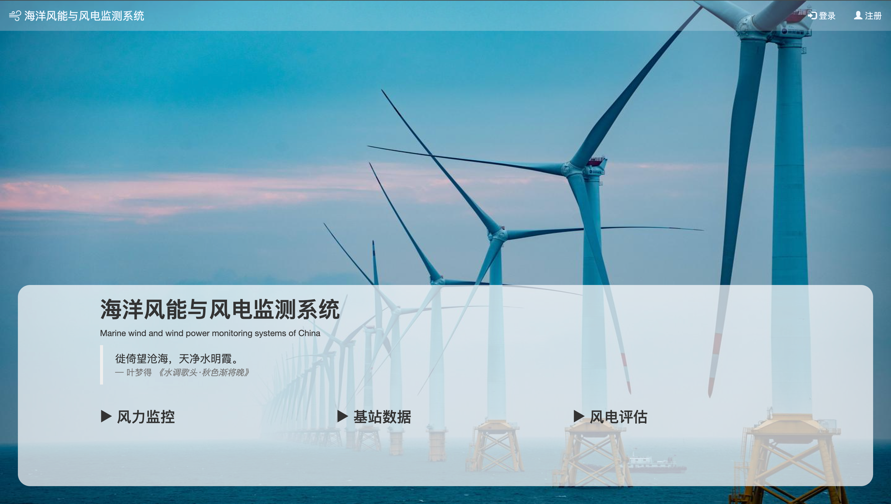
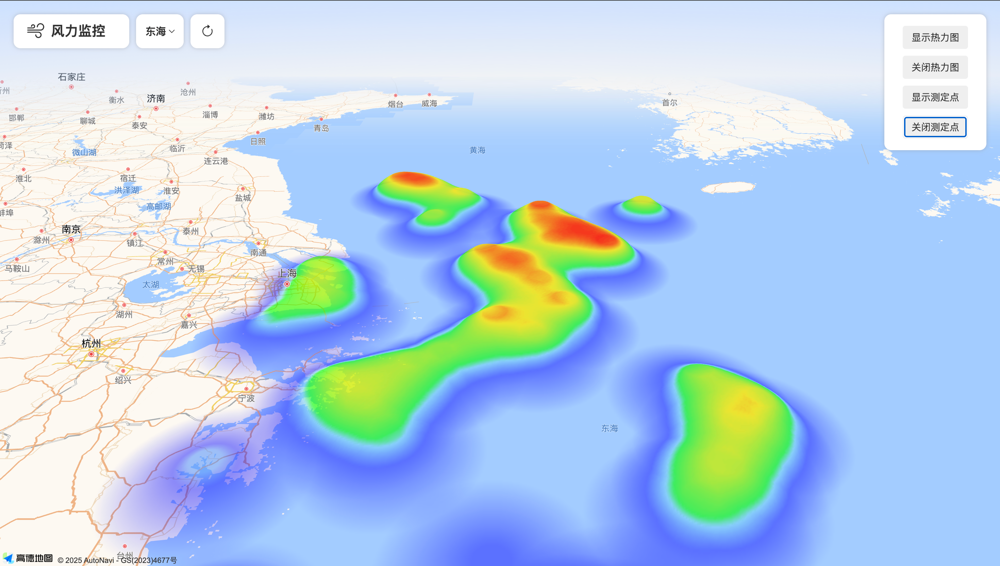
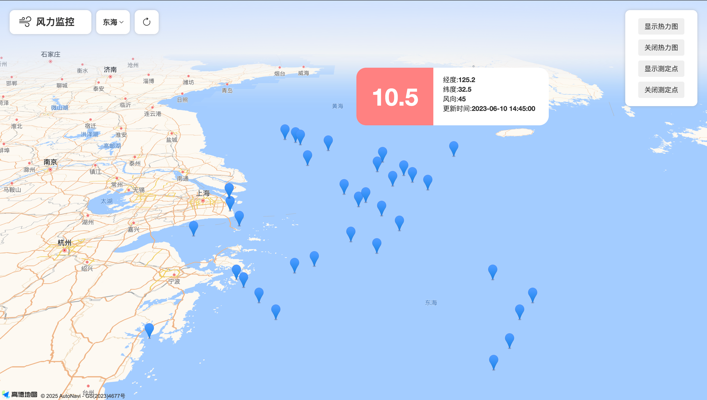
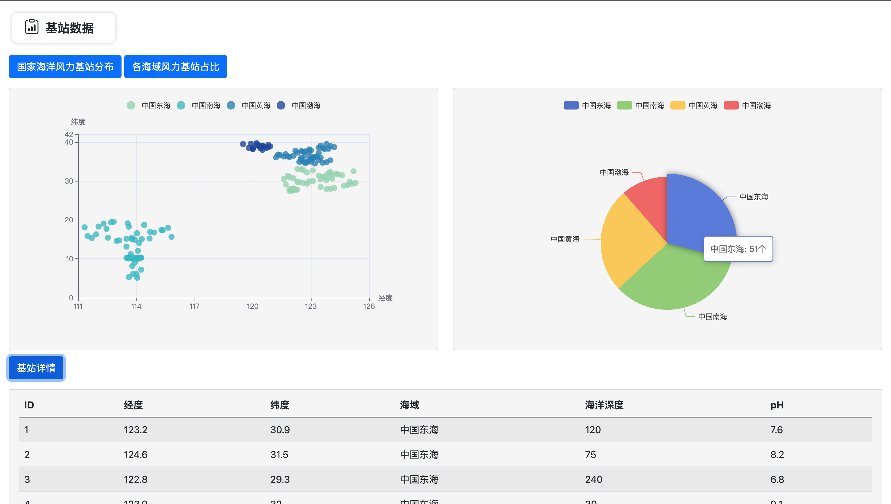
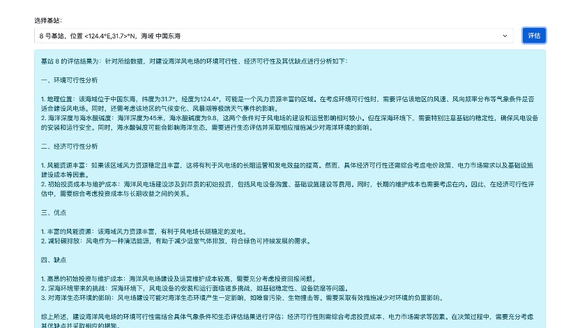
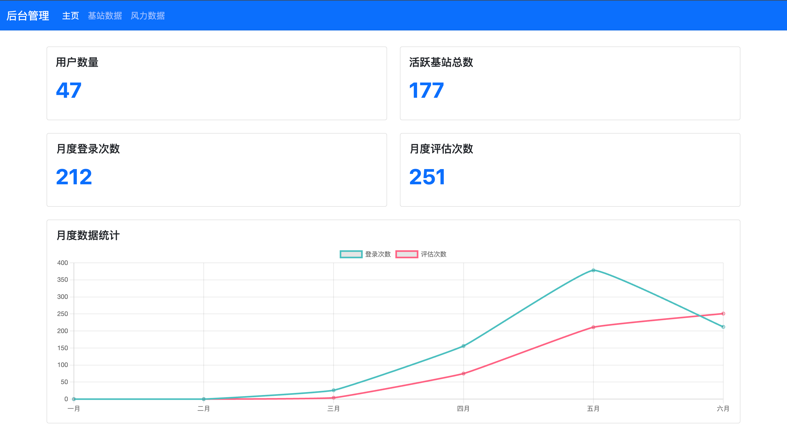
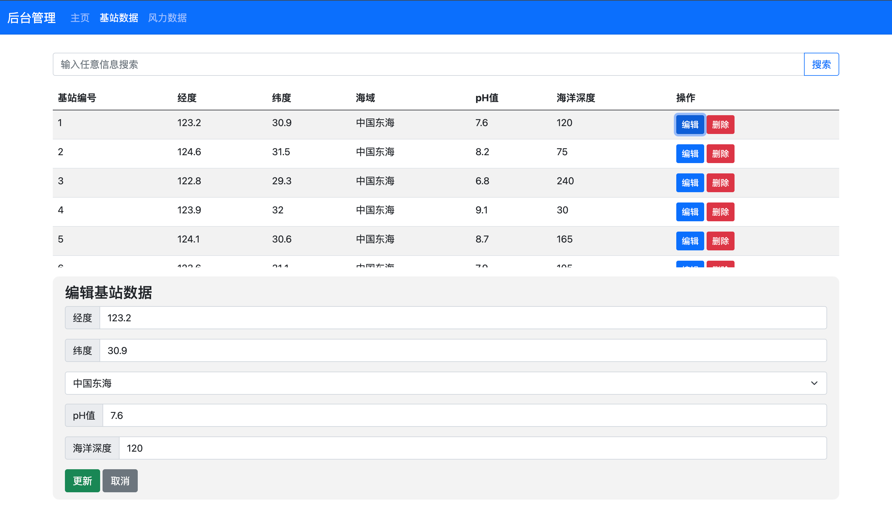
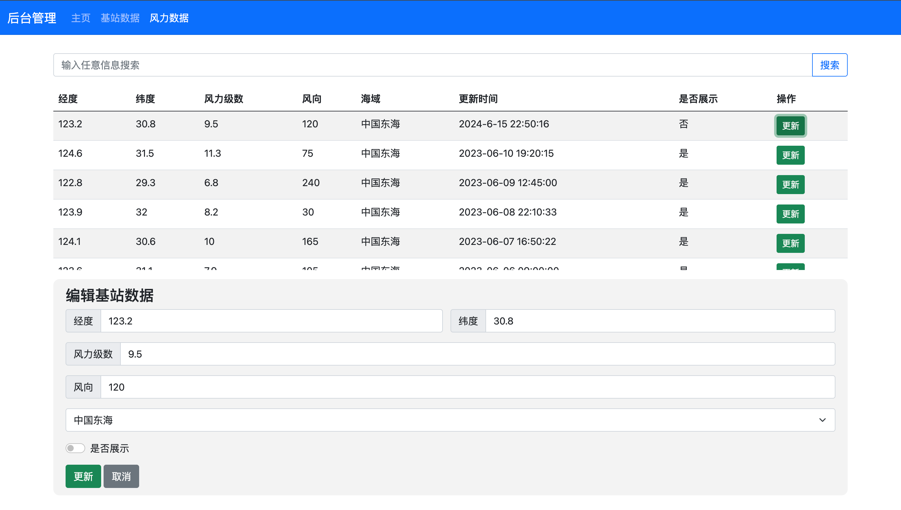

# 海洋风能与风电监测系统

<center>
  <strong>"徙倚望沧海，天净水明霞"</strong><i>  —— 叶梦得 《水调歌头·秋色渐将晚》</i>
</center>


> 2024 数据库本科课程项目｜同济大学计算机科学与技术系

> [!IMPORTANT]
>
> 本项目为海洋风能与风电的监测网站，涉及风力监控的查看、风电数据的查看和风电场位置选址的评估。技术结合 Python `Flask` + `Bootstrap` 前端展示，通过 `flask_sqlalchemy` 实现轻量级数据库管理，集成了`文心一言`大模型的对话功能，实现风电场选址的在线评估。


## 页面

| 主页<br /> | 登陆<br /> |
| ---- | ---- |
| **注册**<br /> | **风力监控（热力图）**<br /> |
| **风力监控（标定点）**<br /> | **基站数据**<br /> |
| **风电场选址评估（文心大模型）** | **管理员页面（主页）**<br /> |
| **管理员页面（风电基站编辑）**<br /> | **管理员页面（风力数据更新）**<br /> |


## 运行项目

### 环境准备

创建虚拟环境

```bash
conda create -n WindPred python=3.12
conda activate WindPred
```

下载依赖

```bash
pip install -r requirements.txt
```


### 启动 flask 网页

```bash
python databaseProj/Include/app.py 
```


### 获取文心一言 aksk

前往 [百度千帆·大模型服务及Agent开发平台](https://cloud.baidu.com/doc/qianfan/index.html) 获取模型aksk，在 `app.py` 中修改以下代码：

```py
# 百度文心api调用对话实现
# 需要自行获取百度文心API的API_KEY和SECRET_KEY
# 参考文档：https://cloud.baidu.com/doc/WENXINWORKSHOP/s/
API_KEY = "自行获取"
SECRET_KEY = "自行获取"
```


## 技术细节

详见 [报告文档](./details.doc)
